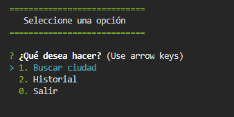
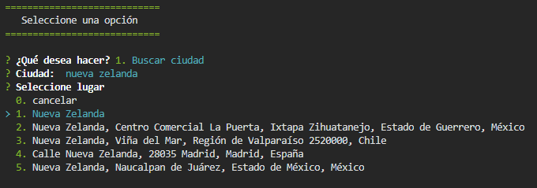
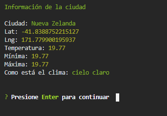
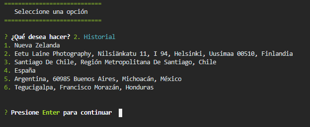

# Weather Console app 

## Sobre: 
Programa por consola en Node para consultar a API **Mapbox** sobre localización y **Openweather** posteriormente para obtener información de temperaturas. 

## Algunas librerias:
colors, inquirer y axios

## Previsualizaciones:

