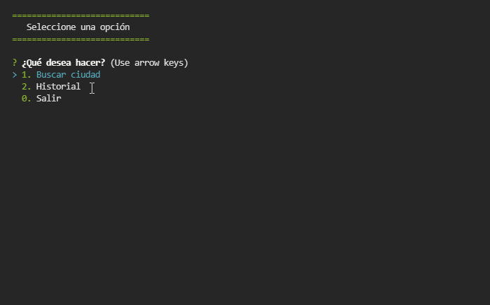

# Weather Console app 

## Sobre: 
Programa por consola en Node que consume APIs **Mapbox** sobre localización y **Openweather** para obtener información de temperaturas. 

## Librerias:
colors, inquirer y axios

## Previsualizacion:

